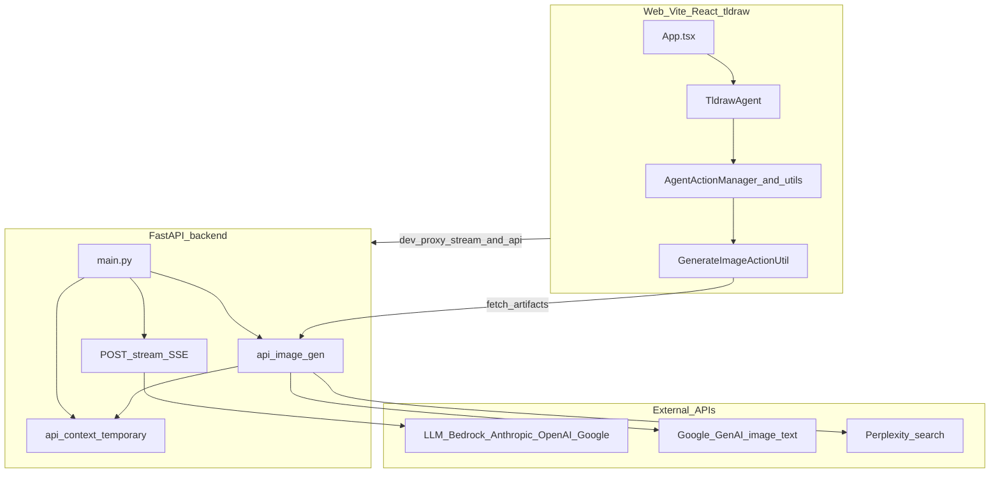
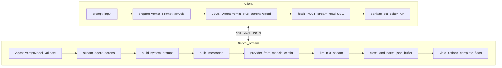
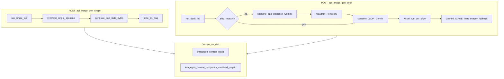

# agent-v2: документация проекта

Документ описывает текущую реализацию пакета **agent-v2** (веб-клиент на tldraw + FastAPI-бэкенд), логику работы агента и соответствие брифу хакатона **AI Brainstorm Canvas**.

---

## 1. Краткое описание продукта

**agent-v2** — это AI-агент, встроенный в канвас [tldraw](https://tldraw.dev). Пользователь работает на доске; агент получает структурированный контекст (сообщения, скриншот области, упрощённые представления фигур, история чата, выбранные элементы, todo, линты и т.д.) и отвечает **потоком JSON-событий** с полем `_type` (действия). Клиент разбирает Server-Sent Events (SSE), для каждого действия вызывает соответствующий **action util**, который через `editor.run` создаёт диффы на доске: создаёт и перемещает фигуры, выравнивает группы, рисует пером, показывает сообщения в чате, запускает генерацию изображений и др.

Ключевая идея кода: модель не возвращает «просто текст в чат», а последовательность **операций над канвасом** и вспомогательных шагов (think, review, todo).

---

## 2. Соответствие брифу Hackathon: AI Brainstorm Canvas

| Требование брифа | Как отражено в коде | Замечания |
|------------------|---------------------|-----------|
| Канвас как среда | [tldraw](https://tldraw.dev) в [web/client/App.tsx](web/client/App.tsx), персистенция через `persistenceKey` | Библиотека канваса не пишется с нуля |
| AI как участник на доске | Действия в [web/client/actions/](web/client/actions/) применяются к `Editor` | Основной deliverable по коду выполнен |
| Канал человек–агент | Текст: [web/client/components/ChatPanel.tsx](web/client/components/ChatPanel.tsx) + промпт в [TldrawAgent.ts](web/client/agent/TldrawAgent.ts) | Ввод частично в сайдбаре; ценность для жюри — **пространственные** действия на доске |
| Генерация медиа | Изображения: действие `generateImage` → [GenerateImageActionUtil.ts](web/client/actions/GenerateImageActionUtil.ts) → API [backend/app/imagegen/](backend/app/imagegen/) | Отдельного пайплайна **видео** в репозитории нет |
| Совместная работа 2+ людей в реальном времени | Не реализовано на уровне синхронизации комнаты | Нет слоя вроде tldraw sync / PartyKit / собственного WebSocket для общей доски |
| Голос | Не реализовано | — |
| Управление со стороны пользователя | Режимы `idling` / `working`, выбор модели в UI, контекст через инструменты «pick shape/area», сайдбар контекста страницы | Можно явно описать на демо как «мы направляем агента контекстом и текстом» |
| Ограничение: **Claude API (Anthropic)** как backbone | Агент-стрим по умолчанию: **Bedrock** с моделями Claude ([backend/app/models_config.py](backend/app/models_config.py), `DEFAULT_MODEL_NAME`); также поддерживаются прямой Anthropic API, OpenAI, Google | Для соответствия брифу на демо: выбрать Claude (Bedrock или Anthropic) и не показывать альтернативы как основной сценарий |
| Imagegen | Google Gemini (текст/картинки) + опционально Perplexity для исследования в deck | Это **не** Claude; для жюри можно озвучить как отдельный модуль генерации слайдов/картинок |

**Риск по формулировке «не чатбот с фоном-доской»:** UI чата справа заметен, но логика оценки «AI as canvas participant» в коде закреплена: ответ модели — это **действия** (`create`, `move`, `generateImage`, …), которые меняют store tldraw.

---

## 3. Архитектура (высокий уровень)



### 3.1. Поток запроса агента: от промпта до фигур на доске



### 3.2. Генерация изображений (imagegen)



Контекст для визуальной генерации: статические файлы бренда/стиля и **временные** загрузки пользователя по `board_id` (ID страницы tldraw; `:` в путях заменяется на `__`). См. [backend/app/imagegen/visual_agent/agent.py](backend/app/imagegen/visual_agent/agent.py) и [backend/app/imagegen/context_routes.py](backend/app/imagegen/context_routes.py).

---

## 4. Backend

### 4.1. Точка входа и HTTP

- [backend/app/main.py](backend/app/main.py): приложение FastAPI, lifespan → `configure_logging`, CORS, `RequestLoggingMiddleware`.
- `POST /stream`: тело JSON → валидация [backend/app/schemas/agent_prompt.py](backend/app/schemas/agent_prompt.py) → `stream_agent_actions` → ответ `StreamingResponse` с заголовками SSE.
- Подключены роутеры: [backend/app/imagegen/routes.py](backend/app/imagegen/routes.py) (`/api/image-gen/...`), [backend/app/imagegen/context_routes.py](backend/app/imagegen/context_routes.py) (`/api/context/temporary/...`).

### 4.2. Стриминг агента и LLM

- [backend/app/agent_service.py](backend/app/agent_service.py):
  - Имя модели из промпта ([backend/app/prompt/get_model_name.py](backend/app/prompt/get_model_name.py)) или `DEFAULT_MODEL_NAME`.
  - `build_system_prompt` + для Bedrock доп. инструкция про сырой JSON с корнем `actions`.
  - Сообщения для API: system отбрасывается из списка, при необходимости assistant-prefill для JSON (кроме Bedrock); seed буфера для Anthropic/Google.
  - Итерация по чанкам текста из [backend/app/llm_stream.py](backend/app/llm_stream.py), накопление в буфере, [backend/app/do_close_json.py](backend/app/do_close_json.py) — «закрытие» незавершённого JSON и `json.loads`.
  - При появлении нового элемента в `actions[]`: предыдущий помечается `complete: true`, текущий стримится с `complete: false`; в конце — финальный `complete: true`.

- [backend/app/llm_stream.py](backend/app/llm_stream.py): провайдеры `bedrock`, `anthropic`, `openai`, `google`; нормализация контента (текст + data URL изображений); для Bedrock при больших картинках возможно сжатие через Pillow под лимит base64.

### 4.3. Схема промпта (что приходит с клиента)

Модель Pydantic `AgentPromptModel` в [backend/app/schemas/agent_prompt.py](backend/app/schemas/agent_prompt.py): части `mode`, опционально `debug`, `modelName`, `messages`, `data`, `screenshot`, `chatHistory`, `blurryShapes`, `peripheralShapes`, `selectedShapes`, `time`, `todoList`, `canvasLints`, `contextItems`, `userViewportBounds`, `agentViewportBounds`, `userActionHistory`. Поле `currentPageId` добавляется на клиенте и не входит в модель как отдельный класс, но используется в `build_system_prompt` при наличии действия `generateImage`.

### 4.4. Сбор текстов системного промпта и сообщений

- [backend/app/prompt/build_system_prompt.py](backend/app/prompt/build_system_prompt.py): флаги из режима, вступление, правила, опционально блок про `pageId` для генерации картинок, JSON schema ответа.
- [backend/app/prompt/build_messages.py](backend/app/prompt/build_messages.py): преобразование частей промпта и истории чата в список user/assistant с контент-блоками.

### 4.5. Imagegen

- [backend/app/imagegen/pipeline.py](backend/app/imagegen/pipeline.py): `run_single_job` (синтетический сценарий из одного слайда), `run_deck_job` (сценарий + слайды).
- [backend/app/imagegen/scenario_agent/agent.py](backend/app/imagegen/scenario_agent/agent.py): при необходимости gap detection → [research_agent](backend/app/imagegen/research_agent/agent.py) (Perplexity) → генерация JSON сценария (Gemini).
- [backend/app/imagegen/visual_agent/agent.py](backend/app/imagegen/visual_agent/agent.py): `load_context`, сбор промпта слайда, `generate_content` с картинками (Gemini), fallback `generate_images` (Imagen).
- Настройки и пути: [backend/app/imagegen/config.py](backend/app/imagegen/config.py) (`GOOGLE_API_KEY`, `PERPLEXITY_*`, каталоги `artifacts`, `context`).

---

## 5. Frontend

### 5.1. Оболочка приложения

- [web/client/App.tsx](web/client/App.tsx): сетка с [ContextSidebar](web/client/components/ContextSidebar.tsx), `Tldraw` с кастомными инструментами (`target-area`, `target-shape`), провайдер агента, [ChatPanel](web/client/components/ChatPanel.tsx).

### 5.2. Класс агента и стриминг

- [web/client/agent/TldrawAgent.ts](web/client/agent/TldrawAgent.ts):
  - `preparePrompt`: для каждого `part` из текущего активного режима вызывается `PromptPartUtil.getPart`, результат склеивается в объект `AgentPrompt`.
  - `streamAgentActions`: `POST` на `import.meta.env.VITE_STREAM_URL ?? '/stream'`, в тело добавляется `currentPageId` с `editor.getCurrentPageId()`.
  - Парсинг SSE: строки `data: {...}`, поле `error` → исключение.
  - `requestAgentActions`: запись в историю чата, цикл по действиям, `sanitizeAction`, `act`, откат `incompleteDiff` при обновлении незавершённого действия, `ignoreShapeLock`, `history: 'ignore'`.

### 5.3. Режимы агента

- Определения: [web/client/modes/AgentModeDefinitions.ts](web/client/modes/AgentModeDefinitions.ts).
  - **`idling`**: неактивен (нет actions/parts для модели).
  - **`working`**: полный набор частей промпта и действий (см. ниже).
- Жизненный цикл: [web/client/modes/AgentModeChart.ts](web/client/modes/AgentModeChart.ts) — при старте промпта из `idling` переход в `working`; при незавершённых todo возможен `schedule` продолжения; разблокировка созданных фигур при выходе из `working`.

**Части промпта в режиме `working`:** `mode`, `debug`, `modelName`, `messages`, `data`, `contextItems`, `screenshot`, `userViewportBounds`, `agentViewportBounds`, `blurryShapes`, `peripheralShapes`, `selectedShapes`, `chatHistory`, `userActionHistory`, `todoList`, `canvasLints`, `time`.

**Действия в режиме `working`:** `message`, `think`, `review`, `addDetail`, `upsertTodoListItem`, `setMyView`, `create`, `delete`, `update`, `label`, `move`, `place`, `bringToFront`, `sendToBack`, `rotate`, `resize`, `align`, `distribute`, `stack`, `clear`, `pen`, `countryInfo`, `generateImage`, `countShapes`, `unknown`.

Реализации лежат в [web/client/actions/](web/client/actions/) и [web/client/parts/](web/client/parts/).

### 5.4. Сборка и прокси

- [web/vite.config.ts](web/vite.config.ts): в dev прокси `/stream` и `/api` на `VITE_AGENT_API` (по умолчанию `http://127.0.0.1:8000`).
- Переменные клиента (см. комментарии в том же файле): `VITE_AGENT_API`, `VITE_STREAM_URL`, `VITE_AGENT_API_BASE` (если статика SPA и API на разных origin).

---

## 6. Запуск для демо

1. Бэкенд (из каталога `backend/`):

   ```bash
   uvicorn app.main:app --port 8000
   ```

2. Фронтенд (из каталога `web/`):

   ```bash
   npm install
   npm run dev
   ```

3. Убедиться, что прокси указывает на живой API или задать абсолютные URL через env.

### 6.1. Переменные окружения (имена, без значений)

**Агент-стрим (в зависимости от выбранной модели в UI):**

- Bedrock (Claude): `AWS_ACCESS_KEY_ID`, `AWS_SECRET_ACCESS_KEY`, опционально `AWS_SESSION_TOKEN`, `AWS_REGION`.
- Anthropic API: `ANTHROPIC_API_KEY`.
- OpenAI: `OPENAI_API_KEY`.
- Google: `GOOGLE_API_KEY`.

**Imagegen** ([backend/app/imagegen/config.py](backend/app/imagegen/config.py)):

- Обязательно для генерации картинок: `GOOGLE_API_KEY`.
- Для исследования в deck: `PERPLEXITY_API_KEY`, опционально `PERPLEXITY_BASE_URL`, модели `PERPLEXITY_MODEL_*`.
- Опционально: `GEMINI_TEXT_MODEL`, `GEMINI_IMAGE_MODEL`, `IMAGEN_MODEL`, пути `IMAGEGEN_ARTIFACTS_DIR`, `IMAGEGEN_CONTEXT_DIR`, и др. из `ImageGenSettings`.

Файл `.env` подхватывается из `backend/.env` или корня репозитория (см. логику в [backend/app/imagegen/config.py](backend/app/imagegen/config.py)).

---

## 7. Ключевые файлы (шпаргалка)

| Область | Путь |
|---------|------|
| HTTP + SSE | [backend/app/main.py](backend/app/main.py) |
| Оркестрация LLM и парсинг actions | [backend/app/agent_service.py](backend/app/agent_service.py) |
| Провайдеры стрима | [backend/app/llm_stream.py](backend/app/llm_stream.py) |
| Модели агента | [backend/app/models_config.py](backend/app/models_config.py) |
| Валидация тела запроса | [backend/app/schemas/agent_prompt.py](backend/app/schemas/agent_prompt.py) |
| Imagegen HTTP | [backend/app/imagegen/routes.py](backend/app/imagegen/routes.py) |
| Временный контекст по странице | [backend/app/imagegen/context_routes.py](backend/app/imagegen/context_routes.py) |
| Пайплайн слайдов | [backend/app/imagegen/pipeline.py](backend/app/imagegen/pipeline.py) |
| UI + канвас | [web/client/App.tsx](web/client/App.tsx) |
| Ядро агента | [web/client/agent/TldrawAgent.ts](web/client/agent/TldrawAgent.ts) |
| Режимы | [web/client/modes/AgentModeDefinitions.ts](web/client/modes/AgentModeDefinitions.ts), [web/client/modes/AgentModeChart.ts](web/client/modes/AgentModeChart.ts) |
| Действие «картинка» | [web/client/actions/GenerateImageActionUtil.ts](web/client/actions/GenerateImageActionUtil.ts) |

---

## 8. Roadmap (идеи под бриф и бонусы)

Не реализовано в текущем коде; возможные направления:

- Совместное редактирование: tldraw sync, PartyKit или аналог; общая «комната» на демо с 2+ людьми.
- Голос: распознавание речи → текст в тот же пайплайн, что и `agent.prompt`.
- Видео: отдельный action + бэкенд или внешний API.
- Проактивные предложения: черновики на доске с подтверждением человеком.
- Несколько персон агента: разные режимы или system prompts.
- Экспорт / replay сессии.

---

## 9. Заключение

**agent-v2** закрывает ядро брифа «агент как участник на канвасе» за счёт потока структурированных действий и богатого контекста доски. Для хакатон-демо стоит явно показать **изменения на доске**, заранее выбрать **Claude** как backbone для чат-агента и честно обозначить отсутствие **мультиплеера** и **голоса**, если их не успели добавить.
